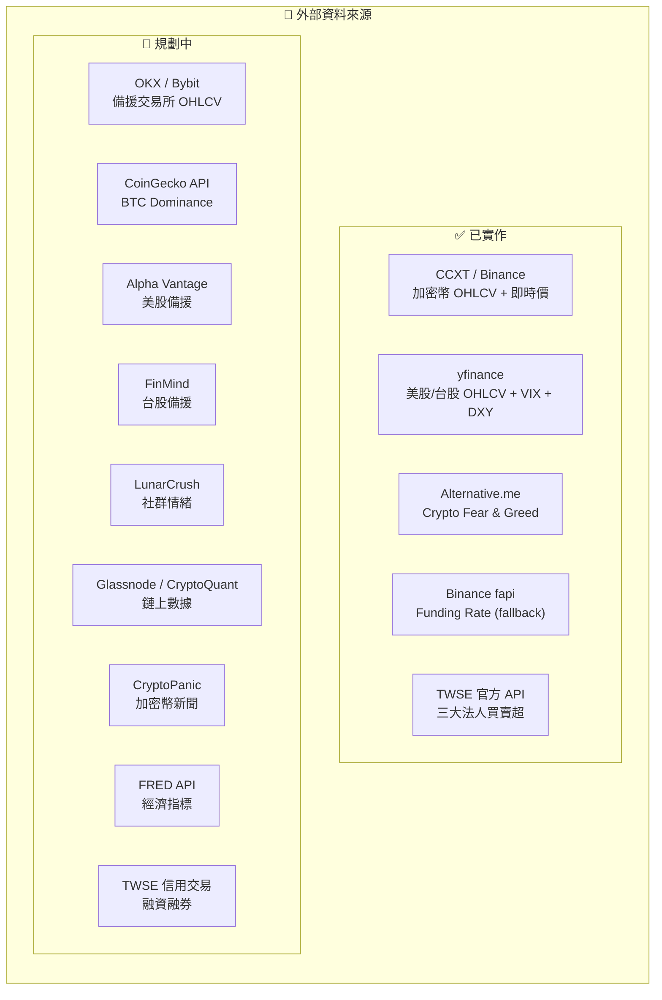
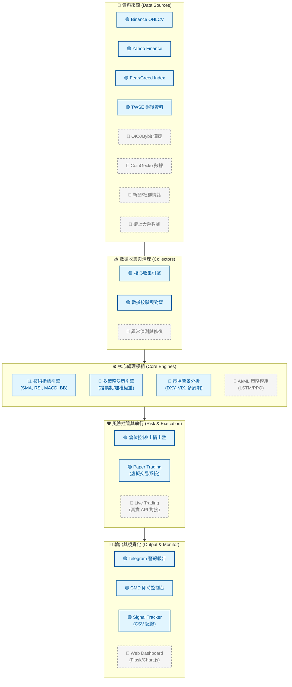

# 自主交易機器人 — 系統架構全景圖

> **實線** `───` = 已實作　｜　**虛線** `- - -` = 尚未實作（規劃中）
>
> 此文件為 **Living Document**，隨功能完善持續更新。

---

## 一、資料來源層（Data Sources）

---

# 🏦 自主交易機器人 — 系統架構全景圖

> **實線** `━━` = 已實作 (Done) ｜ **虛線** `- -` = 規劃中 (Pending)
> 💡 *這是一個動態藍圖，會隨著系統開發進度持續更新。*

---

## 一、 核心架構流程

---

## 二、 開發進度統計

| 模組分組 | 功能描述 | 狀態 | 進度 |
| :--- | :--- | :---: | :---: |
| **基礎建設** | OHLCV 抓取、指標計算、虛擬交易模擬 | ✅ 已完成 | 100% |
| **策略核心** | 多周期分析、加權投票、情緒濾網 | ✅ 已完成 | 100% |
| **風控模組** | ATR 動態止損、追蹤止損、單筆風險控制 | ✅ 已完成 | 90% |
| **監控與通報** | Telegram 全能報告、CMD 面板、績效 CSV | ✅ 已完成 | 95% |
| **數據多樣化** | 備援 API (OKX, AlphaVantage)、鏈上、新聞 | 🚧 規劃中 | 20% |
| **進階功能** | Web UI 介面、AI 預測、實盤交易銜接 | 🚧 規劃中 | 10% |

---

## 三、 系統擴展優先序 (Roadmap)

1.  **[短] 資料高可用**：實作 `CCXT` 多交易所 failover，確保 Binance 維護時仍有報價。
2.  **[中] Web 前端**：開發 Flask 儀表板，取代目前純文字的 Telegram/CMD 報告。
3.  **[長] AI 優化**：匯入歷史 Signal Tracker 資料，利用 ML 對策略權重進行動態回測優化。

> [!TIP]
> 每次新增或完善一個模組後，更新此圖中對應節點的顏色從 `plan`（灰色虛線）改為 `done`（綠色實線），即可持續追蹤進度。
